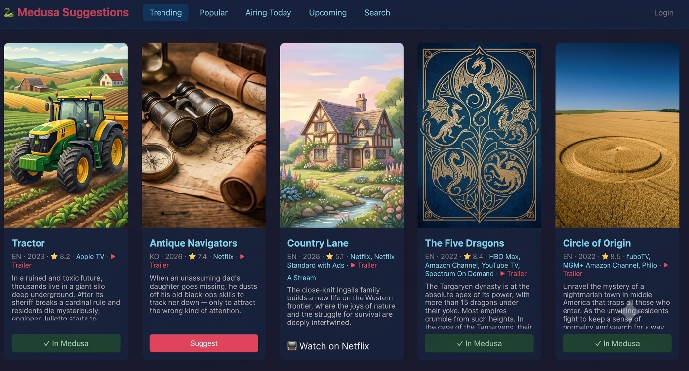

<<<<<<< HEAD
# Medusa Suggestions

A lightweight TV show suggestion and discovery app that integrates with [Medusa](https://github.com/pymedusa/Medusa) PVR. Browse trending, popular, and upcoming shows from TMDb, let users suggest shows, and approve them directly into Medusa with one click.

## ⚠️ Disclaimer

> Note: I vibe coded the 5h!t out of this as this was custom written for my own needs, therefore cannot support this or look at requests nor do I have time, however feel free to submit issues if you find any — just no features please. I will fix it as and when I can but no guarantees.

## Features

- **Browse TV Shows** — Trending, Popular, Airing Today, and Upcoming feeds from TMDb
- **Search** — Find any TV show via TMDb
- **Suggest** — Users click "Suggest" to add a show to the pending queue
- **Admin Approval** — Approve or ignore suggestions; approved shows get added to Medusa automatically via API
- **Already in Medusa** — Shows already in your Medusa library are flagged with "✓ In Medusa" instead of a suggest button
- **Streaming Providers** — Shows which streaming services carry each show on every card (lazy-loaded, cached 24h)
- **"Watch on" Detection** — If a show is already available on a streaming service you subscribe to (configured in admin settings), the suggest button is replaced with "📺 Watch on [service]" — preventing unnecessary downloads of shows you can already stream
- **Trailers** — YouTube trailer links on each card
- **Multi-User** — Optional login system with per-user filter preferences
  - Anonymous users see global defaults and can suggest
  - Logged-in users get personal filter overrides
  - Admin manages users, settings, and approvals
- **Filters** — Configurable via admin settings UI:
  - Allowed languages (e.g. English, Korean, Japanese only)
  - Excluded countries
  - Excluded genres (checkboxes)
  - Minimum rating
- **Medusa Integration** — Uses Medusa API v2 to add shows by TVDB ID
- **Dark Theme** — Responsive UI with hamburger menu on mobile
- **Configurable Layout** — Card size and grid gap adjustable in settings
- **Show More** — Load additional pages of results with one click
- **Docker Ready** — Single container deployment

## Tech Stack

- **Python 3.12** + FastAPI + Uvicorn
- **SQLite** via aiosqlite (zero-config database)
- **Jinja2** templates (server-rendered, no JS framework)
- **httpx** for async HTTP to TMDb and Medusa APIs
- **passlib + bcrypt** for password hashing
- **itsdangerous** for signed session cookies
- **Docker** + Docker Compose

## Quick Start

```bash
git clone https://github.com/YOUR_USERNAME/medusa-suggestions.git
cd medusa-suggestions

# Edit docker-compose.yml to set your ADMIN_PASSWORD and SECRET_KEY
docker compose up -d --build
```

The app will be available at **http://localhost:8087**

## Configuration

All configuration is done via the web UI after first launch:

1. Open `http://localhost:8087`
2. Click **Login** (default: `admin` / your `ADMIN_PASSWORD`)
3. Go to **Admin** → **Settings**
4. Enter your **Medusa URL** and **API Key**
5. Enter your **TMDb API Key** (free from [themoviedb.org/settings/api](https://www.themoviedb.org/settings/api))
6. Configure your filters and streaming services

### Environment Variables

| Variable | Description | Default |
|----------|-------------|---------|
| `ADMIN_PASSWORD` | Initial admin password (used on first run to create admin user) | `admin` |
| `SECRET_KEY` | Secret for signing session cookies (change this!) | `medusa-suggestions-secret-change-me` |
| `DB_PATH` | Path to SQLite database | `/data/suggestions.db` |

### Getting API Keys

#### TMDb
1. Create an account at https://www.themoviedb.org
2. Go to Settings → API → Request an API key
3. Use the **API Key (v3 auth)** value (short hex string, NOT the long JWT token)

#### Medusa
1. Open your Medusa web UI
2. Go to General Settings → Interface → API Key
3. Or check `config.ini` in your Medusa data directory for `api_key`

## User Management

- **Admin** can add/delete users and reset passwords via Admin → Users
- **Regular users** can log in, set personal filter preferences (language, genres, rating), and suggest shows
- **Anonymous visitors** can browse and suggest without logging in (using global filters)

## Docker Compose

```yaml
services:
  medusa-suggestions:
    build: .
    container_name: medusa-suggestions
    ports:
      - "8087:8555"
    volumes:
      - ./data:/data
    environment:
      - ADMIN_PASSWORD=changeme
      - SECRET_KEY=change-this-to-a-random-string
    restart: unless-stopped
```

## Screenshots




## License

MIT
=======
# medusa-suggestions
TV show suggestion and discovery app for Medusa PVR with TMDb integration
>>>>>>> f98baef7a43d40d6e529aabf4200a931ef49def3
